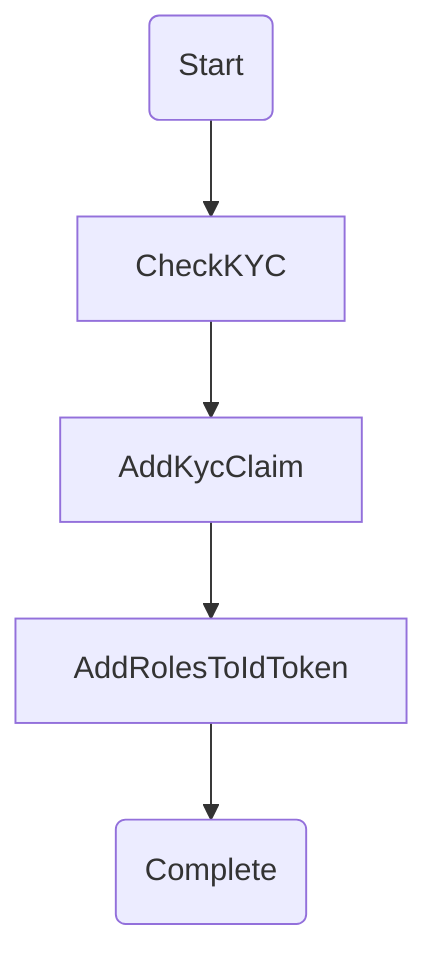

# Casino Application Sample

The Casino application is a gambliing website where users login and gamble online. The application demonstrates the following key featuers:

- Login with Auth0 using a redirect-based Authorization Code flow with PKCE 
- Enforce KYC for age consent per each jurisdiction during the login process by redirecting to a KYC page
- Allow users to switch between applications (gambling jurisdictions) and SSO automatically if already logged-in previously. During the switching, KYC enforcement takes place if a user has never logged-in before
- Enforce KYC in the API layer as well when retrieving a "Welcome Coupon", a discount coupon offered to users 
- Allow an admin user to opt-in/out the KYC requirement for each jurisdiction

The demo applications are hosted in the following locaitons:

Casino Web Sites:

- New York State Casino `ny-casino` https://ny-casino.vercel.app
- Alabama State Casino `al-casino` https://al-casino.vercel.app
- Colorado State Casino `co-casino` https://co-casino.vercel.app

Backend API:
- Casino API `casino-api` https://api-casino.vercel.app

## Table of Contents

- [How it works](#how-it-works)
- [Auth0 Application Setup](#auth0-application-setup)
- [Auth0 API Setup](#auth0-api-setup) 
- [Auth0 User Management](#auth0-user-management)
- [Auth0 Action Setup](#auth0-action-setup)
- [Sample Code](#sample-code)

## How it works

### Login 
Let's start with `ny-casino` application. 
Press on the Login button to start the login process with Auth0. 
Use Google social login or an existing user account to sign in, or sign up with a new user. 
The login process uses Authorization Code Grant with PKCE flow.

### KYC process
During the login process, you will get redirected to the KYC page prompting you for a age consent. 
We use Auth0's "Action" feature to interrupt the login to display a KYC page and continue the process upon obtaining the age consent. 
Upon a successful login, you get redirected to a Home page. 

### Get a Welcome Coupon
On the Home page, there is a button that says "Get a Welcome Coupon!". 
Click it and you will get a Discount Coupon with a random discount rate.
Behind the scene, the frontend application makes a call to the backend API (`casino-api`) to generate a discount coupon. 
The `casino-api` will also enforces KYC verificaiton and returns an error if the user has not completed the KYC process yet.

### SSO to the other applications in different jurisdictions 
At the bottom of the Home page, there are links to other casino applications in other jurisdictions.
For example, clicking on the "Alabama State Casino" link will redirect you to the `al-casino` application. 
During the transition, another login process with Authorization Code with PKCE flow initiates and it tries to authenticate you with the `al-casino` applicaiton. 
Once you pass the KYC proces, then you get redirected to the Home page of the `al-casino` application.   
Behind the scene, we keep track of the KYC status for each jurisdiction in the User App Metadata as below:

```json
{
  "KYC_DONE_@_ny-casino": true,
  "KYC_DONE_@_al-casino": true,
}
```

The Auth0 "CheckKYC" Action in the Login Flow checks the value to determine whether it should redirect the user to the target app's KYC page or not.
If you go back to the `ny-casino` application now, then this time you won't get prompted for the KYC because you've already done the KYC at New York State.

### Login with Administrator and enable/disable KYC requirement for each state
Logout from the application, and use the administrator credential below to login the `ny-casino`.

| User Name | Password |
|--|--|
| `admin@yusasaki.dev` | `Password12345`|

Visit the Profile page under your avatar icon. 
Notice that there is a custom claim called `https://yusasaki-casino/roles` whose value is set to `Casino KYC Admin`. 
This administrative roles gives the user a special permission to invoke an administative operation in the backend `casino-api` API. 

### Enable/disable KYC requirement 
With the `Casino KYC Admin` role, an "Admin" page apperas in the Navigation. In the Admin page, you see the application metadata listed in JSON format.
```json
{
  "KYC_REQUIRED": "true",
  "NAV_BG_COLOR": "light",
  "TITLE": "New York State Casino"
}
```
The `KYC_REQUIRED` flag dictates whether the application enforces the KYC process or not. An administrator can toggle the value to enable/disable the KYC process. 
Behinde the scene, the backend `casino-api` API interacts with Auth0 Management API by requesting access token using `client_credentials` grant and propagates the request to update the client information. 
The backend `casino-api` protects accessing the API by checking `update:kycrequirement` scope exists in the Access Token or not.

## Auth0 Application Setup 

### Create SPA Applications 
1. Create a set of new "Single Page App" application, each named `ny-casino`, `al-casino` and `co-casino`.
1. For each application, configure the "Application URIs":

    | Key | `ny-casino` | `al-casino` | `co-casino` |
    |--|--|--|--|
    | Allowed Callback URLs | http://your-ny-app |http://your-al-app |http://your-co-app |
    | Allowed Logout URLs   | http://your-ny-app |http://your-al-app |http://your-co-app |
    | Allowed Web Origins   | http://your-ny-app |http://your-al-app |http://your-co-app |

    > :warning: You must replace each URL (e.g. http://your-ny-app) with the correct URL of your application. For example, if you are running a `ny-casino` app at `http://localhost:3000` then that's the value you use.


1. For each application, in "Advanced Settings" > "Client Metadata", add the following metadata:

    | Key | `ny-casino` | `al-casino` | `co-casino`
    |--|--|--|--|
    | KYC_REQUIRED | true |  true | true |
    | TITLE   | New York State Casino | Alabama State Casino | Colorado State Casino |
    | NAV_BG_COLOR | light | warning | info |

1. For each application, Keep note of `Client ID` value.

### Create a Machine-to-Machine Application (`casino-kyc-management`)

1. Create a new "Machine to Machine" application named `casino-kyc-management`. This is an app that makes authorized request to "Auth0 Management API" from the backend. 

1. Under APIs tab, make sure the app is authorized to request Access Token for "Auth0 Management API".

## Auth0 API Setup 

### Create an API (`casino`)

Create a custom API called `casino` with the following configuration:

- RBAC Settings
    | Key | Value
    |--|--|
    | Enable RBAC | true |
    | Add Permissions in the Access Token | true |

- Permissions
    | Permission | Description 
    |--|--|
    | `update:kycrequirement` | Update KYC Requirement (ON / OFF) |

### Configure Auth0 Management API 

This is a Auth0 System API that exists by default. Under "Machine to Machine Applications" tab, make sure that `casino-kyc-management` application is authorized to request an Access Token to this API with `read:clients` and `update:clients` scopes. This is because the our backend API needs to update `KYC_REQUIRED` flag of the client (application) metadata, and to do that the backend API will need to request an Access Token to Auth0 Management API.

## Auth0 User Management

### Administrator Role Setup

1. Create a role called "Casino KYC Admin".
2. Add Permission: `update:kycrequirement`

### Administrator User Setup

1. Create an administrative user. (e.g. `admin@yourcompnay.com`) 
2. Assign a role: "Casino KYC Admin"

## Auth0 Action Setup

### Build custom actions

Create the following custom actions:

  - Check KYC ([sample code](https://github.com/sasaki-san/auth0-exercise-monorepo/blob/main/auth0/login-actions/check-kyc.js))
     - This action is responsible for checking whether the target applicaiton requires KYC, and if so, checks if the user has completed the KYC. If the user has not done yet the required KYC, then the handler will redirect the user to the target application's KYC page. Once the KYC is done, the login process continues from `onContinuePostLogin` handler, and the KYC completion flag is set at the client.
  - Add Kyc Claim ([sample code](https://github.com/sasaki-san/auth0-exercise-monorepo/blob/main/auth0/login-actions/add-kyc-claim.js)) 
     - This action is responsible for adding a custom claim `https://yusasaki-casino/{clientId}/kycdone` to the Access Token with the value indicating if the user has done the KYC process with the target client or not.
  - Add Roles To IdToken ([sample code](https://github.com/sasaki-san/auth0-exercise-monorepo/blob/main/auth0/login-actions/add-roles-to-idtoken.js)) 
     - This action is responsible for adding a custom claim `https://yusasaki-casino/roles` to the ID Token with the assigned role.

### Associate custom actions to Login Flow

Associate all 3 actions to the Login Flow as below:


## Sample Code 

### Frontend (`react/`)

Each application is configured through `.env` environment variables, and depending on the `client_id` specified, the application takes a differen role (ie. `ny-casino`, `al-casino`, `co-casino`). 

The following describe the steps required to run the frontend application as `ny-casino` role at the port 3000. 
To run other roles (`al-casino`, `co-casino`) at the same time to test SSO experience, copy the `react` folder multiple times, and run each instance on a different port. 

#### Local Development Setup

1. Go to `react` folder

1. Copy `.env.sample` to `.env`, and fill the environment variables.  

    ```.env
    # Specify the port to run this app
    PORT=3000

    # Auth0 Domain
    REACT_APP_DOMAIN=auth0-techex-yusasaki.jp.auth0.com

    # Client ID of this application (e.g. ny-casino)
    REACT_APP_CLIENT_ID=GLMWJgu9c3qMsJDLS2XhMDXHTNoQVg27

    # Audience value of the custom API (e.g. casino-api)
    REACT_APP_AUDIENCE=https://casino-api

    # A message to display on the KYC page
    REACT_APP_KYC_MESSAGE="I CERTIFY THAT I AM 19 YEARS OF AGE OR OLDER"

    # The origin URL of the backend API
    REACT_APP_API_ORIGIN="http://localhost:8080"

    # The link to the ny-casino application
    REACT_APP_NY_CASINO_LINK=http://localhost:3000

    # The client ID of the ny-casino application
    REACT_APP_NY_CASINO_CLIENT_ID=GLMWJgu9c3qMsJDLS2XhMDXHTNoQVg27

    # The link to the al-casino application
    REACT_APP_AL_CASINO_LINK=http://localhost:4000

    # The client ID of the al-casino application
    REACT_APP_AL_CASINO_CLIENT_ID=5j6WbHit3DSvr4MxHLzlTQf4pdTvxOnE

    # The link to the co-casino application
    REACT_APP_CO_CASINO_LINK=http://localhost:5000

    # The client ID of the co-casino application
    REACT_APP_CO_CASINO_CLIENT_ID=LaIekCxldO82mYVERJppEGxuJ08c0NGv
    ```
1. Run `npm install` to install dependencies

1. Run `npm run spa`

### Backend (`api/`) 

The backend API is a protected resource server with `casino` API and provides multiple API routes:
- `/api/public`
    - Anyone can access the resource without Access Token
- `/api/user`
    - Only available for authenticated users.
- `/api/admin`
    - Only available for administrators.
    - A resource request is further routed to the Auth0 Management API to perform administrative tasks.

#### Local Development Setup

1. Go to `api` folder

1. Copy `.env.sample` to `.env`, and fill the environment variables.

    ```.env
    # Specify the port to run this app
    PORT=8080

    # Auth0 Domain
    DOMAIN=auth0-techex-yusasaki.jp.auth0.com

    # The custom API's Audience URI (e.g. casino-api)
    AUDIENCE=https://casino-api

    # List of the URLs that are allowed to make CORS requests to this API
    CORS_ALLOWED_ORIGIN_LIST=http://localhost:3000,http://localhost:4000,http://localhost:5000

    # The client ID of the casino-kyc-management (Machine-to-Machine) Application 
    M2M_CLIENT_ID=<YOUR_CLIENT_ID>

    # The client Secret of the casino-kyc-management (Machine-to-Machine) Application 
    M2M_CLIENT_SECRET=<YOUR_CLIENT_SECRET>
    ```

1. Run `npm install` to install dependencies

1. Run `npm run dev `
